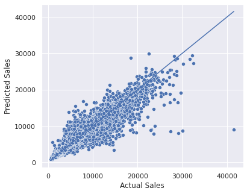
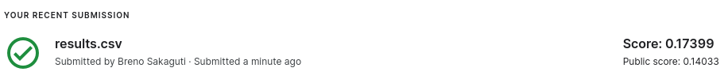

# Rossmann Sales Prediction
## Introduction
Rossmann is a drug store chain in Europe operating thousands of stores throughout the continent. This project is based on a [competition](https://www.kaggle.com/competitions/rossmann-store-sales/overview) hosted on Kaggle that involved predicting sales figures six weeks in advance based on past performance. The competition has since ended, but the data will be used in the project as practice.
## The Project
The project is composed of two jupyter notebook files, `rossmann_sales_prediction.ipynb` which contains the initial exploratory analysis and visualization of the data, and `rossmann_models.ipynb`, where we prepared the data for the machine learning models, trained them and used it to predict sales. Finally, the predicted data was sent back to Kaggle to be scored.
### Data Exploration
In the initial phase of the project, the data was analyzed to find the most relevant variables for the model, and to give a better understanding on how they affect the target metric, the sales figure. Hypotheses were formulated and tested, and graphs were plotted to visualize the relationships between the parameters.

*Figure: An example of a graph showing the impact of promotions in sales*
### Model Building
After finding the most important variables, they were extracted, normalized and encoded to prepare them for a machine learning model. As an initial step, three models were analyzed: a simple model where each store's sales figure was assumed to be the average of the previous sales was used as a baseline. The other two were a linear regression and a Random Forest regression. The models were trained with the data from sales up to six weeks before the end of the dataset, and were tested on the remaining six weeks. Their performance is shown in the table below.
Model              | MAE    | MAPE   |  RMSE 
----------         |--------|------- |--------
Random Forest      | 765.09 | 0.1132 |  1158.53
Baseline 	         |1429.76 | 0.2168 |	1939.34
Linear Regression  |1872.23 | 0.2950 |  2676.98

The Random Forest model was by far the best performing, with almost half the average error as the baseline, so it was chosen to proceed with the project.

*Figure: The relationship between the predicted and real sales value*

As seen in the plot, the model is relatively unbiased in predicting sales, except for some outliers where the sales were considerably underestimated, which could be the subject of further inquiry. For now, they will be left as is.
### Returning to Kaggle
After training, the model was used on previously-unseen test data, which was used in the Kaggle competition. The scoring method for the competition was Root Mean Square Percentage Error (RMSPE), in which the model used for the project was scored 0.17399.

*The Kaggle submission*

The score fell considerably short of the winning score for the competition, which was 0.10021, indicating a lot of improvement could be made.
## Conclusion
The project shows that a simple model with minimal tuning can have reasonably good results, although getting the best predictions would take a lot more to do. As an exploratory project, it presented a lot of avenues on new things to do and improvements to be made. Some other considerations for future projects include:
- Looking at more successful models in the competition to see which methods could have been done better
- Setting up a more organized code, with an unified pipeline for more streamlined fitting and testing
- Experimenting with other machine learning algorithms to find the best fit for the task in question. (XGBoost in particular seemed popular in that competition)
- Doing more fine-tuning to find the best hyperparameters for the model and data
