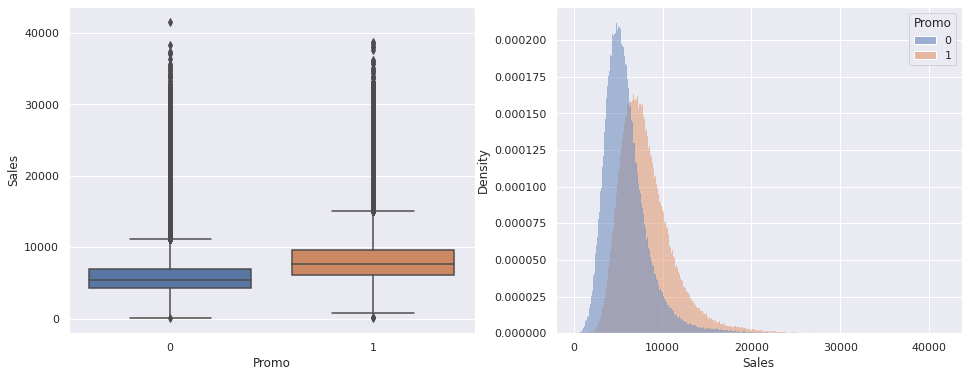

# Rossmann Sales Prediction
## Introduction
Rossmann is a drug store chain in Europe operating thousands of stores throughout the continent. This project is based on a [competition](https://www.kaggle.com/competitions/rossmann-store-sales/overview) hosted on Kaggle that involved predicting sales figures six weeks in advance based on past performance. The competition has since ended, but the data will be used in the project as practice.
## The Project
The project is composed of two jupyter notebook files, `rossmann_sales_prediction.ipynb` which contains the initial exploratory analysis and visualization of the data, and `rossmann_models.ipynb`, where we prepared the data for the machine learning models, trained them and used it to predict sales. Finally, the predicted data was sent back to Kaggle to be scored.
### Data Exploration
In the initial phase of the project, the data was analyzed to find the most relevant variables for the model, and to give a better understanding on how they affect the target metric, the sales figure. Hypotheses were formulated and tested, and graphs were plotted to visualize the relationships between the parameters.

*Figure: An example of a graph showing the impact of promotions in sales*
### Model Building
After finding the most important variables, they were extracted, normalized and encoded to prepare them for a machine learning model. As an initial step, three models were analyzed: a simple model where each store's sales figure was assumed to be the average of the previous sales was used as a baseline. The other two were a linear regression and a Random Forest regression. The models were trained with the data from sales up to six weeks before the end of the dataset, and were tested on the remaining six weeks. Their performance is shown in the table below.
Model              | MAE    | MAPE   |  RMSE 
----------         |--------|------- |--------
Random Forest      | 765.09 | 0.1132 |  1158.53
Baseline 	         |1429.76 | 0.2168 |	1939.34
Linear Regression  |1872.23 | 0.2950 |  2676.98

The Random Forest model was by far the best performing, with almost half the average error as the baseline, so it was chosen to proceed with the project.
